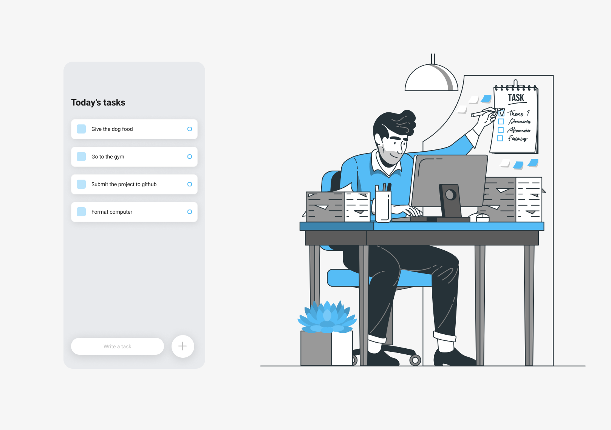

<div align="center">
  
</div>

  # 🗂️ Topics
   * <a href="#About"> About</a>
   * <a href="#Layout"> Layout</a>
   * <a href="#Features"> Features</a>
   * <a href="#How-to-use"> How to use</a>
      * <a href="#Prerequisites"> Prerequisites</a>
      * <a href="#Running-the-app"> Running the app</a>
   * <a href="#Technologies"> Technologies</a>
   * <a href="#License"> License</a>
   * <a href="#Author"> Author</a>

  <h1 id="About">📖 About</h1>
  <p>I created this simple project to add and remove tasks.</p>

  <h1 id="Layout">💅🏻Layout</h1>
  

  <h1 id="Features">📌 Features</h1>

  - [x] Add a task with the name you want
  - [x] Remove the task you want with just one click.
  - [ ] Forget some task.

  <h1 id="How-to-use">🤓How to use</h1>

  <h3 id="Prerequisites">Prerequisites</h3>

  <p>To be able to use the application, you need the following tools: </p>
  <a href="https://git-scm.com"> Git </a> •
  <a href="https://nodejs.org/en/"> Node.js </a> •
  <a href="https://expo.io"> Expo </a>

  <h3 id="Running-the-app">Running the app</h3>

  ```bash
  # Clone this repository
  $ git clone <https://github.com/ejscf/todo-list.git>

  # Open the APP folder on the terminal
  $ cd todo-list

  # Install all APP modules
  $ npm install or yarn install

  # Now just turn on the APP
  $ expo start
  ```

  <h1 id="Technologies">💻Technologies</h1>

  <p>The following tools were used in the construction of the project:</p>

  - <a href="https://reactnative.dev/">React Native</a>
  - <a href="https://www.ecma-international.org">Javascript</a>
  - <a href="https://expo.io">Expo</a>

  <h1 id="License">📜License</h1>

  
    
  <h1 id="Author">✍🏻Author</h1>
   
  <p>Edson Jorge 🦔</p>